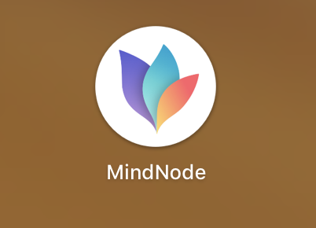

## Es6 脑图笔记

下载mindNode人软件(ipad mac ipone 都有

没有ios都小伙伴，可以看mindnote导出都文本(效果不太理想)

## 文件夹说明

es6(文件夹):是课程udacity课程都习题，es6有两个子文件夹:
question[就是问题],answer[答案]。
 
mindnode(文件夹): 脑图源文件。

text(文件夹): mindnode 导出都text文本。

## 课程笔记路线图(以下说明了笔记都进度)

1、es6课程 1 脑图

